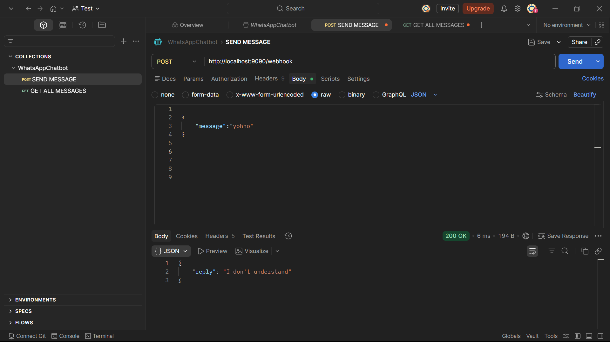
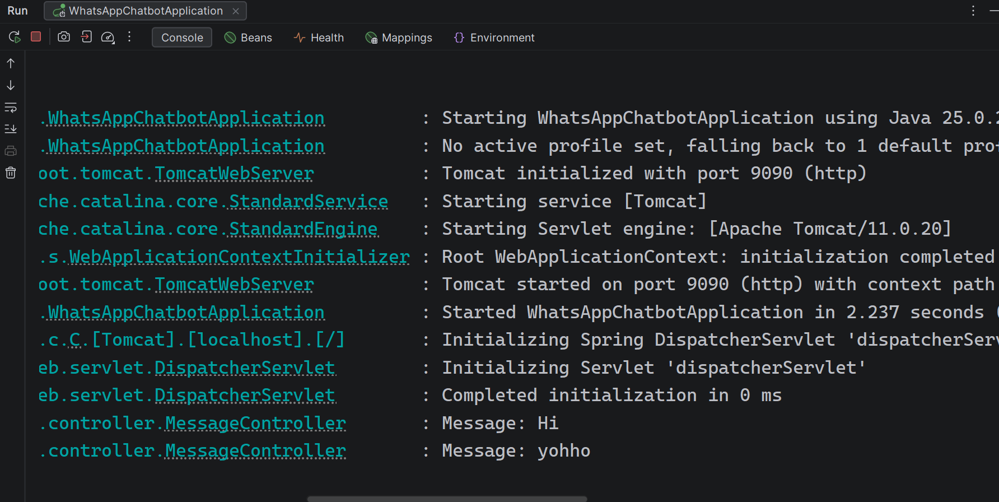
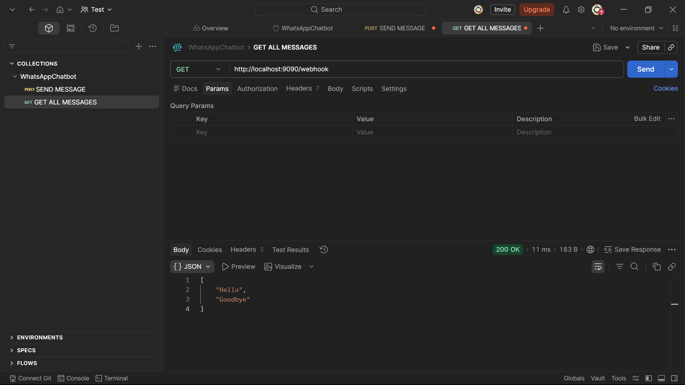

# WhatsApp Chatbot (Spring Boot)

## About Project

This is a simple WhatsApp chatbot backend simulation made using Spring Boot.
It receives messages through an API and returns predefined replies.

This project is created as part of an internship assignment.

---

## Features

* POST API to receive messages
* Returns replies like:

    * Hi → Hello
    * Bye → Goodbye
* Handles unknown messages
* Logs incoming messages in console
* GET API to see all messages (extra feature)

---

## Technologies Used

* Java
* Spring Boot
* REST API
* SLF4J Logger

---

## API Endpoints

### 1. Send Message

**POST /webhook**

Request:

```json
{
  "message": "Hi"
}
```

Response:

```json
{
  "reply": "Hello"
}
```

---

### 2. Get All Messages

**GET /webhook**

Response:

```json
[
  "Hi",
  "Bye"
]
```

---

## How to Run

1. Clone the project
2. Open in IntelliJ or any IDE
3. Run the main class (WhatsAppChatbotApplication)
4. Test using Postman

---

## Screenshots

### POST API


### Unknown Message


### Logs


### GET API


---

## Demo Video

https://drive.google.com/file/d/1OqzOLN1BC-a98fuWMo8fyYrUDDM2OD6H/view?usp=sharing

---
## 🚀 Live Demo

https://whatsapp-chatbot-dej5.onrender.com/

---
## Author

Saurabh Rawat
